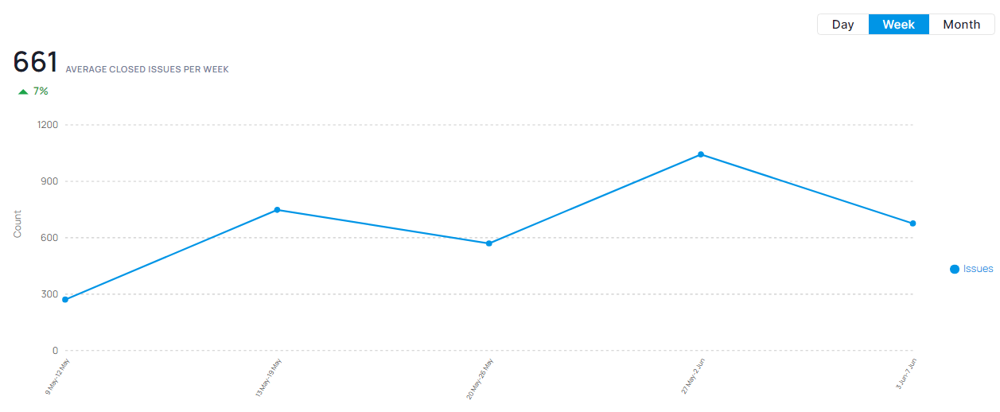

# Issue Closed Count/Task Velocity

### **1. Introduction:**

This document explains how to analyze and visualize the rate of issue or task completion using the **Issue Closed Count** or **Task Velocity** metric. It's represented as a line chart showing the number of issues or tasks closed over time (daily, weekly, or monthly). This metric provides valuable insights into team productivity, workload management, and potential bottlenecks in your workflow.

### **2. Definitions:**

* **Issue/Task:** A unit of work representing a bug, feature request, or other work item within your project management system.
* **Issue Closed Count/Task Velocity:** The number of issues or tasks closed within a specific timeframe (e.g., day, week, month).

### **3. Explanation of Charts:**

**Detailed Chart:**&#x20;

<figure><figcaption></figcaption></figure>

The line chart displays the Issue Closed Count or Task Velocity over a chosen timeframe.

* **Horizontal Axis:** Represents time intervals (e.g., days, weeks, months).
* **Vertical Axis:** Represents the number of issues or tasks closed.
* **Trend Line:** Shows the average rate of issue/task closure over time.

### **4. Interpretation:**

**Identifying Trends:** The line chart helps visualize trends in issue or task completion rates.

* **Increasing Trend:** An upward trend indicates increasing team productivity or improved workflow efficiency.
* **Decreasing Trend:** A downward trend suggests potential bottlenecks, decreased team capacity, or changes in issue complexity.
* **Flat Trend:** A flat line may indicate a consistent workflow, but also a lack of improvement or changes in workload.

### **5. Key Points:**

* **Productivity Monitoring:** Track Issue Closed Count/Task Velocity to assess team productivity and workload management.
* **Identifying Bottlenecks:** Analyze trends to identify potential bottlenecks or areas where issue resolution is slowing down.
* **Work Management:** Monitor this metric to ensure a healthy balance between workload and team capacity.

### **6. Conclusion:**

Monitoring Issue Closed Count/Task Velocity provides valuable insights into your team's efficiency in resolving issues or completing tasks. By analyzing trends and taking corrective actions when necessary, you can optimize your workflow, improve team productivity, and identify areas for improvement.

**Additional Considerations:**

* The interpretation of trends may depend on factors like project phase, resource availability, and issue complexity.
* Consider using this metric in conjunction with other metrics (e.g., cycle time, work in progress) for a more comprehensive view of your workflow health.
